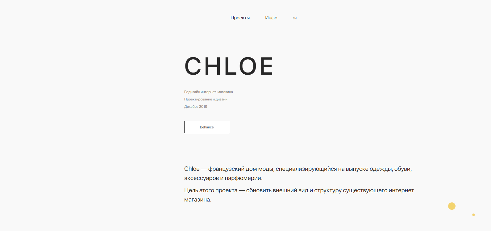

# Creating a portfolio site for a UI / UX designer

This site was designed for UI / UX designer Svetlana, who aims to demonstrate her work.

The main feature of the site is its minimalistic design and great interactivity. During the development, it was taken into account to make the product unique in order to emphasize the lack of stereotyping, as well as to show modern approaches to site building.

In the work on the site used modern tools and technologies, such as:
* Html
* Css
* Javascript
* Pug
* Scss
* Jquery
* Gsap
* ScrollMagic
* PixiJs
* Webpack
* PhpStorm
* NodeJs (v14.17.5)

To speed up the speed of loading the site, I minified images.

As a result, you can watch a site that looks modern, has a smooth interface and loads quickly on any device.

To see the result of this work, you can follow the link [svetlana-webdesign.ru](https://svetlana-webdesign.ru)

